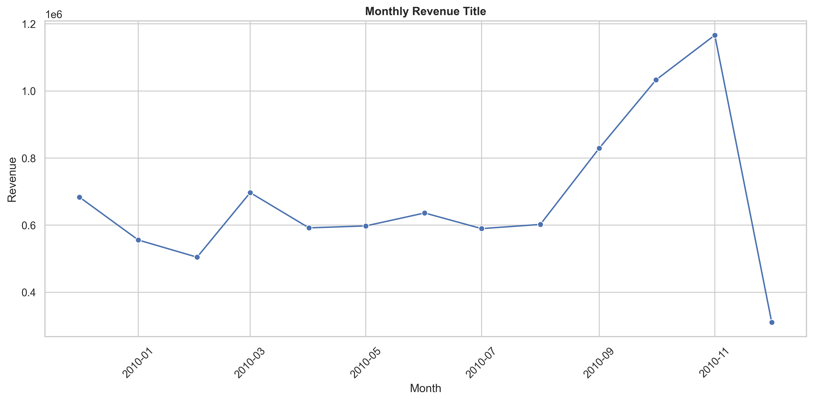
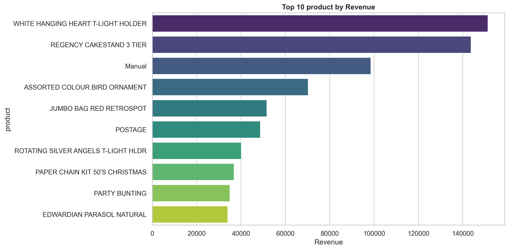
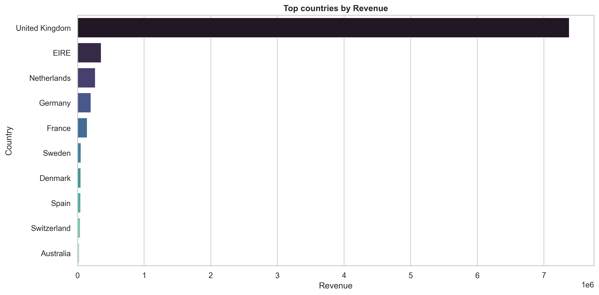
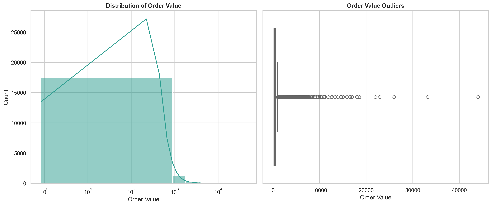
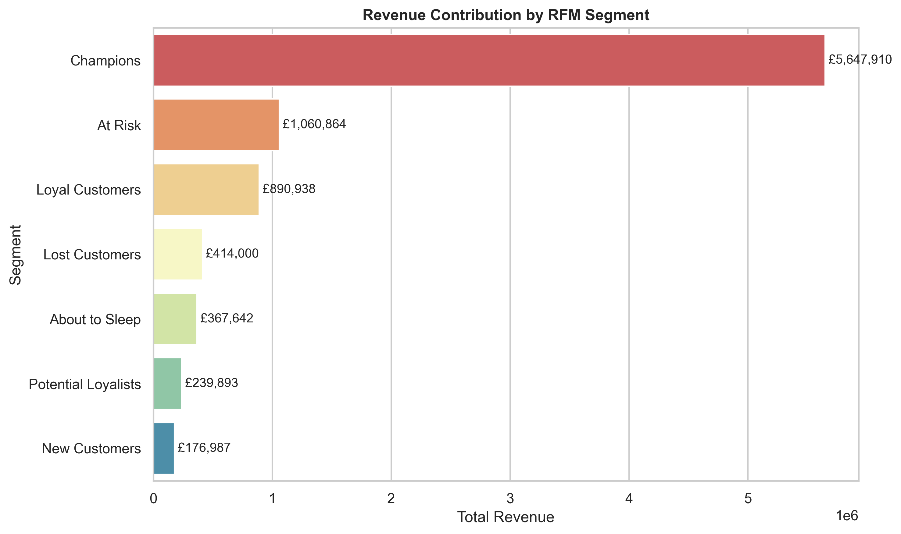
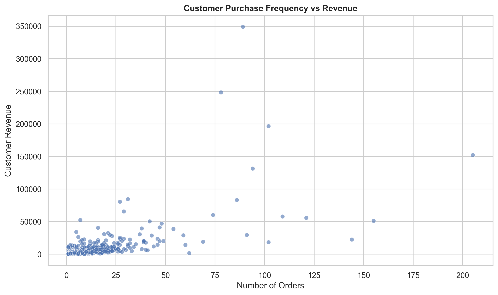
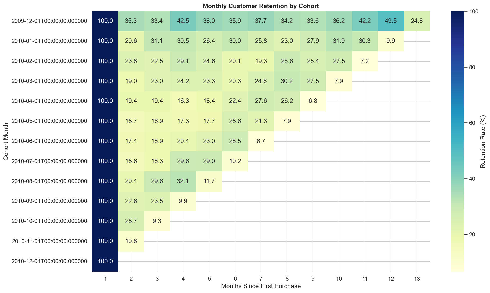
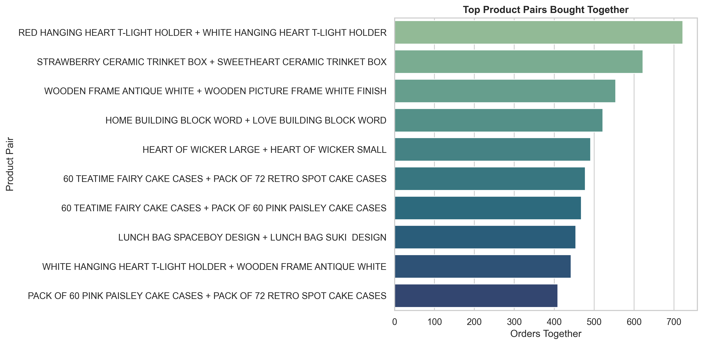

#  E-Commerce Customer Analytics: RFM Segmentation, Cohort Retention & Market Basket Insights


## 📌 Project Overview

This project analyzes real e-commerce transaction data to understand 
customer behavior, revenue trends, and product bundling opportunities. 
Every chart is connected to a business action — not just visualization 
for the sake of it.

This project is part of my Data Science and AI learning journey,
focusing on transforming raw e-commerce data into actionable 
business insights.

---

## 🚀 Project Highlights

- Cleaned and processed 500K+ e-commerce transactions.
- Performed customer segmentation using RFM analysis.
- Built cohort retention analysis to measure repeat purchases.
- Identified frequently purchased product bundles.
- Created both static and interactive visualizations.
- Converted analytical findings into business recommendations.

---

## 📊 Dataset
- **Dataset Source:** [UCI Machine Learning Repository - Online Retail II](https://archive.ics.uci.edu/dataset/502/online%2Bretail%2Bii)
- **Citation:** Chen, D. (2012). Online Retail II [Dataset]. UCI Machine Learning Repository. https://doi.org/10.24432/C5CG6D
- **Dataset License:** Creative Commons Attribution 4.0 International (CC BY 4.0)
- **Source:** UCI Online Retail II Dataset
- **Size:** 525,461 transactions
- **Period:** December 2009 — December 2010
- **Countries:** 40
- **Columns:** Invoice, StockCode, Description, Quantity, 
InvoiceDate, Price, Customer ID, Country

---

## 🛠️ Tools Used

| Tool | Purpose |
|------|---------|
| Python | Core language |
| Pandas | Data cleaning and manipulation |
| NumPy | Numerical operations |
| Matplotlib | Static visualizations |
| Seaborn | Advanced static charts |
| Plotly | Interactive visualizations |
| Jupyter Notebook | Development environment |

---

## 📋 Steps Performed

1. Data loading and inspection
2. Missing value and duplicate analysis
3. Data cleaning — removed returns, nulls, duplicates
4. Feature engineering — revenue, cohort month, customer metrics
5. Core EDA — KPIs, monthly trends, top products, countries
6. RFM Segmentation — scored and segmented all customers
7. Cohort Retention Analysis — monthly heatmap
8. Market Basket Analysis — top product pairs
9. Plotly Interactive Charts
10. Business insights and recommendations

---

## 🔑 Key Insights

- 💰 **Total Revenue:** £8,798,233 from 19,213 orders
- 👥 **Total Customers:** 4,312 unique customers
- 🏆 **Champions** (911 customers) generate **£5.6M** — 64% of total revenue
- ⚠️ **700 At Risk customers** have not purchased recently — urgent reactivation needed
- 📦 **Top Product:** WHITE HANGING HEART T-LIGHT HOLDER — highest revenue
- 🌍 **United Kingdom** dominates — 85%+ of total revenue
- 🔄 **Retention is low** — only 20-35% customers return after first purchase
- 🛍️ **Top Bundle:** RED HANGING HEART + WHITE HANGING HEART — bought together 700+ times
- 📈 **Revenue peaked** in November 2010 — seasonal trend detected

---

## 💡 Business Recommendations

- **Protect Champions** with VIP perks and early access
- **Win back At Risk** customers with urgency based campaigns
- **Improve retention** — build second purchase journey within 30 days
- **Bundle top pairs** — RED + WHITE HANGING HEART as checkout recommendation
- **Expand into secondary markets** to reduce dependence on the UK customer base

---

## 📸 Visualizations

### Monthly Revenue Trend


### Top 10 Products by Revenue


### Top Countries by Revenue


### Order Value Distribution


### RFM Segment Revenue


### Customer Orders vs Revenue


### Cohort Retention Heatmap


### Top Product Pairs


### 🎯 Interactive Visualizations

The notebook also includes interactive Plotly charts for:

- Monthly revenue trends
- Top-performing products
- Customer RFM segmentation

Run the notebook to explore these interactive visualizations.

---

## 📂 Project Structure
```

├── ECommerce_Customer_Analytics_EDA.ipynb
├── images/
├── README.md
└── requirements.txt

```
---

## ▶️ How to Run

```bash
pip install -r requirements.txt
jupyter notebook
```

Open `ECommerce_Customer_Analytics_EDA.ipynb` and run all cells.

---

## Limitations

- This analysis uses transactional data only, so customer demographics such as age, gender, and income are not available.
- Cancelled orders and negative quantities were removed to focus on successful purchase behavior; return behavior can be analyzed separately.
- Profit margin data is not available, so product performance is evaluated using revenue instead of profitability.
- The analysis covers historical transactions, so external factors such as marketing campaigns, holidays, stock availability, and pricing changes are not fully captured.
- Market basket analysis is based on frequently bought-together product pairs, not advanced association rules such as lift, confidence, or support.

---

## ✅ Conclusion

This project goes beyond basic charts — every visualization 
leads to a business action. RFM segmentation, cohort retention, 
and market basket analysis together give a complete picture of 
customer health and revenue opportunities.

---

## 👩‍💻 About

**Minahil Kanwal**  
BSCS Student | Aspiring AI & Data Science Professional

This project reflects my ongoing journey to develop practical 
skills in Python, Data Analytics, Machine Learning, and 
Artificial Intelligence through real-world business datasets.